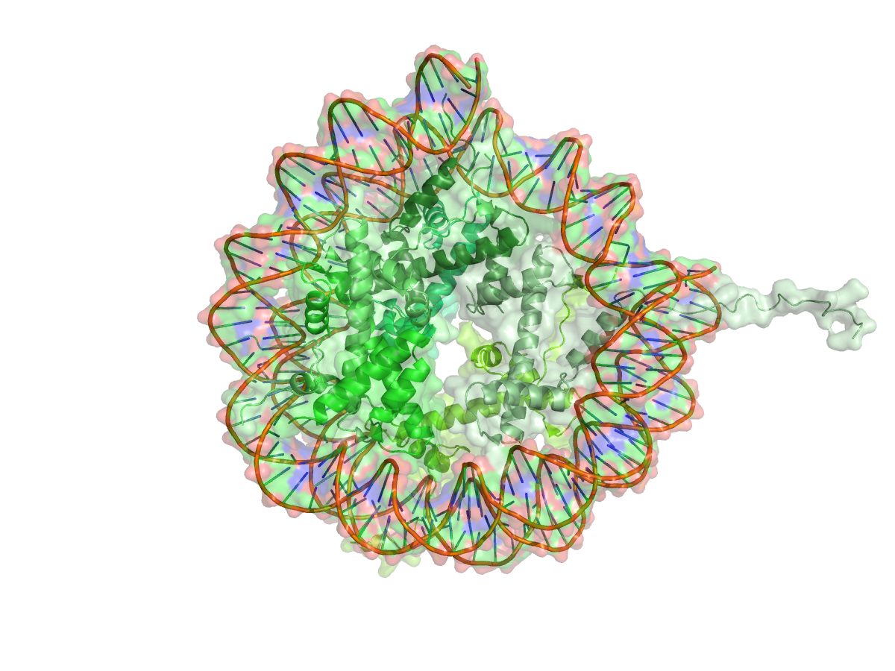
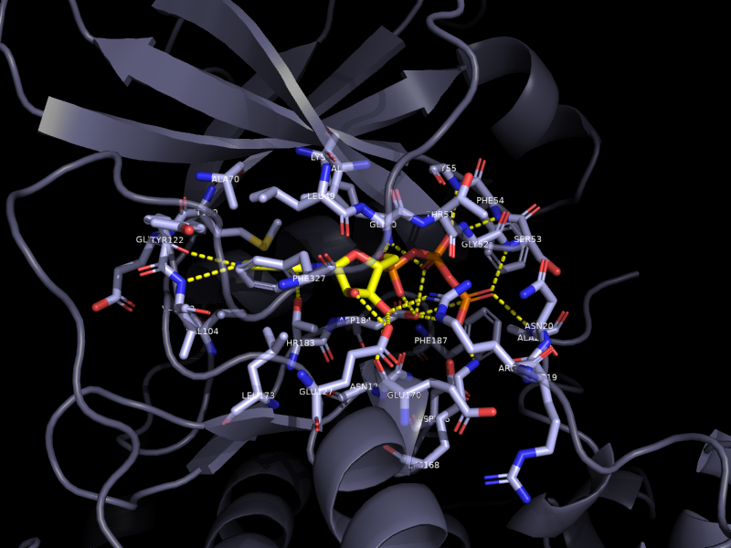
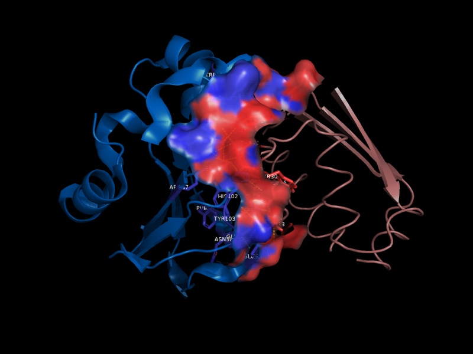
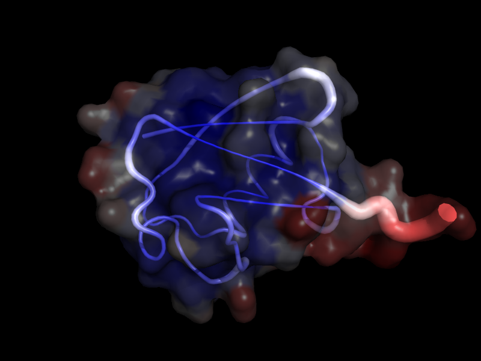
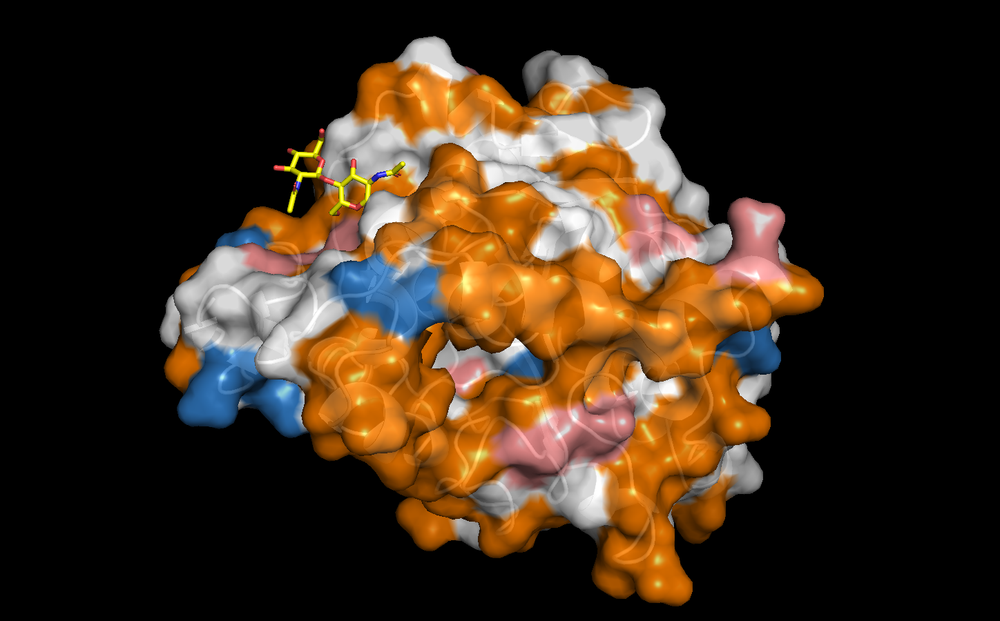
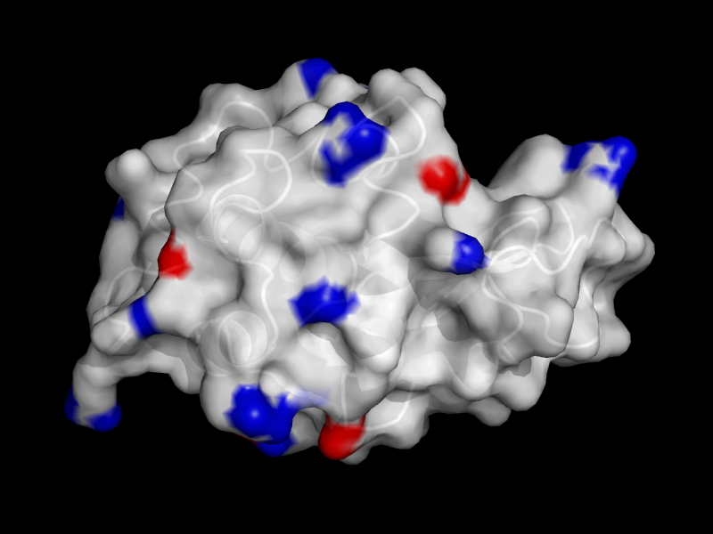
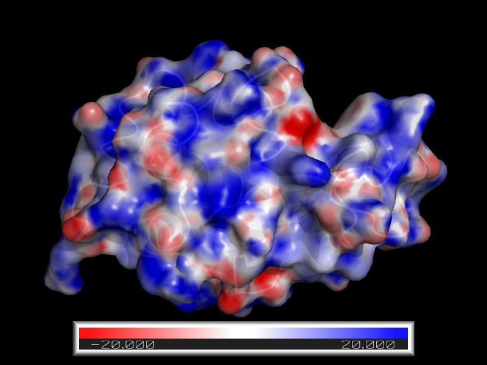
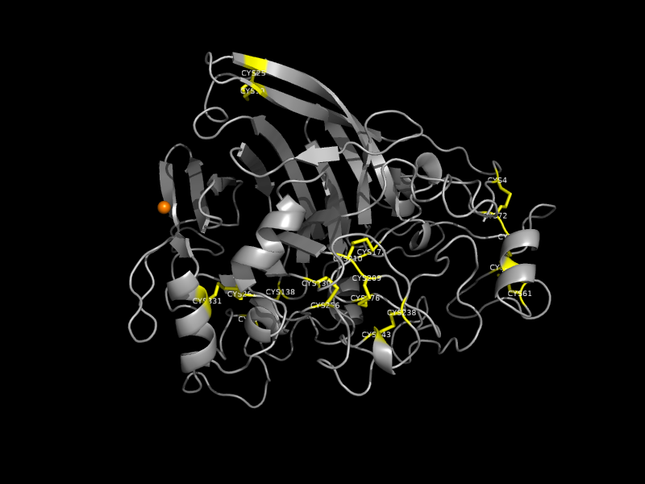
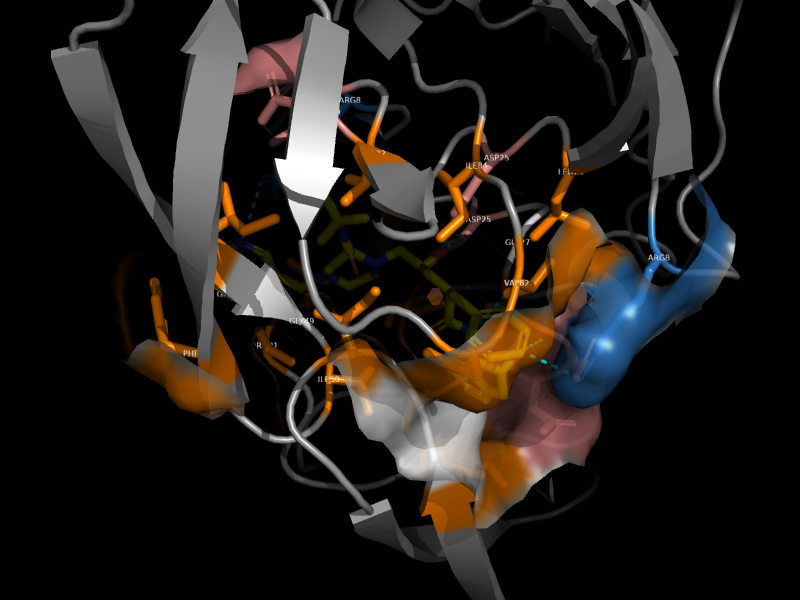
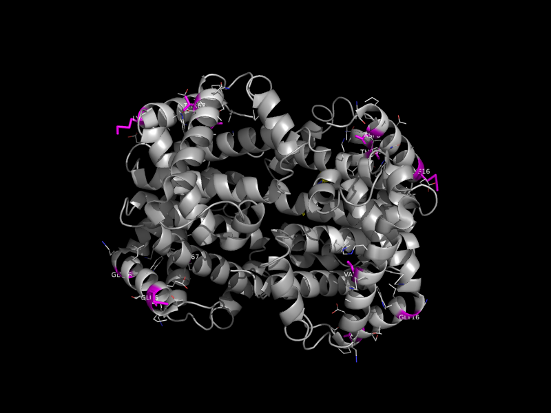

# MCPymol: An MCP Server for PyMOL



**MCPymol** is a Model Context Protocol (MCP) server that provides a conversational interface for viewing and analyzing protein structures using PyMOL. It exposes PyMOL's powerful molecular visualization capabilities to AI assistants (like Claude), allowing you to seamlessly load structures, manipulate views, and explore proteins using natural language. For example, I made the image above by typing this prompt into Claude Code, "Show me a nucleosome". Literally, that was it. 

**A few words...** Let's face it. Pymol is great, but it's terrible to use. The syntax is extremely obscure, and while it's got python in the name, it's not exacly python. This is for people who just want to look at structures and have fun with proteins in a simple, conversational way. 

This code was developed from scratch using a combination of Antigravity, Gemini Pro 3.1 (until I ran out of tokens) and then Claude Code (Sonnet 4.6 thinking). Claude gave itself credit. Gemini did not. Read into that what you will. All the development was done on macos, with testing using the open source pymol available through homebrew. It's been tested with both Claude Code and Gemini CLI. No plans to test on other models/assistants.

**the name** My best friend in high school once shared an apartment with MC Chris, who voiced MC Pee Pants in Aqua Teen Hunger force. I'm not saying that this was the inspiration for the name of this project, but I'm also not denying it.

## 🧬 What it Does

MCPymol acts as a bridge between an AI assistant and a running PyMOL desktop instance. It provides:
- **50+ Auto-Generated PyMOL Commands**: Claude has direct access to PyMOL primitives like `show`, `hide`, `color`, `distance`, `get_chains`, `select`, and many more.
- **Smart Multimer & Solvent Heuristics**: When fetching or loading structures, MCPymol automatically attempts to fetch the **biological assembly** (the functional multimer) and applies an **iterative Breadth-First Search (BFS) style heuristic** to isolate the primary multimer. Starting with the first chain, it recursively adds all neighboring chains within a customizable radius (default **5.0Å**) until the selection stabilizes. This ensures that large circular or sprawling assemblies like the CRP pentamer or Ferritin cage are kept whole, while removing distant crystallographic copies from the unit cell. It also automatically hides waters, solvents, and non-standard crystallization additives for a clean, relevant view.
- **Dual-Process Architecture**: To circumvent PyMOL's internal Python dependency limitations, MCPymol runs via a two-part bridge. A native PyMOL script runs a lightweight background socket listener inside your PyMOL App, while a standalone FastMCP server handles communication with the AI assistant.

## 🛠️ Intended Use

MCPymol is designed for structural biologists, bioinformaticians, and anyone interested in protein structures who wants a natural language conversational partner for PyMOL. You can ask Claude to:
- "Fetch ubiquitin (1ubq) and show it as a cartoon."
- "Color the alpha helices red and the beta sheets blue."
- "Measure the distance between residue 10 and residue 20."
- "Highlight the active site."

## 💾 Installation & Configuration

Because PyMOL requires its own isolated Python environment to run its GUI and rendering loops, using MCPymol requires starting both the PyMOL plugin and configuring the external MCP server for your AI assistant.

### 1. Start the Native PyMOL Plugin (Required for all setups)
1. Open your standard PyMOL desktop application.
2. In the PyMOL command line, manually initialize the background listener script. Adjust the path to where you cloned the repository:
   ```pymol
   run /path/to/MCPymol/src/mcpymol/plugin.py
   ```
   *You should see a message in the PyMOL console indicating the plugin is listening on `127.0.0.1:9876`.*

**💡 Pro Tip: Auto-Start the Plugin**
The standard way to run initialization scripts in PyMOL is through its `pymolrc` resource file. To automatically run this plugin every time you launch PyMOL, add the following to `~/.pymolrc.py`:
```python
import os, pymol
pymol.cmd.do("run /absolute/path/to/MCPymol/src/mcpymol/plugin.py")
```

**🔌 Changing the Port**
The default port is `9876`. If you need to run multiple MCP servers simultaneously, override it with the `MCPYMOL_PORT` environment variable before launching PyMOL **and** the bridge:
```bash
# PyMOL (macOS example)
MCPYMOL_PORT=9867 open -a PyMOL

# MCP bridge/server
MCPYMOL_PORT=9867 uv run mcpymol
```

---

### 2. Configure Your AI Assistant

Choose ONE of the following setups based on your environment and preferred AI assistant. All instructions assume you have cloned the repository to your machine.

```bash
git clone https://github.com/yourusername/MCPymol.git
cd MCPymol
```

#### Option A: macOS with Claude Code CLI (Using `uv`)
This is the recommended setup if you are using Claude Code in the terminal (i.e., the `claude` CLI, not the Claude Desktop app).

1. **Install dependencies:**
   ```bash
   uv sync
   ```
2. **Register the MCP server** by running the following in your terminal:
   ```bash
   claude mcp add mcpymol -- uv --directory /absolute/path/to/MCPymol run mcpymol
   ```
3. Start a new Claude Code session. Ensure the PyMOL plugin is running, and you're ready to start asking conversational questions about protein structures!

#### Option B: macOS with Claude Desktop (Using `uv`)
This is the standard setup for users of the Claude Desktop app using `uv` for dependency management.

1. **Install dependencies:**
   ```bash
   uv sync
   ```
2. **Configure Claude Desktop:** Add the following to your `claude_desktop_config.json` file:
   ```json
   {
     "mcpServers": {
       "mcpymol": {
         "command": "uv",
         "args": [
           "--directory",
           "/absolute/path/to/MCPymol",
           "run",
           "mcpymol"
         ]
       }
     }
   }
   ```
3. Restart Claude Desktop. Ensure the PyMOL plugin is running, and you're ready to start asking conversational questions about protein structures!

#### Option C: macOS with Gemini CLI (Using `uv`)
This is the standard, unrestricted setup for Gemini CLI users using `uv`.

1. **Install dependencies:**
   ```bash
   uv sync
   ```
2. **Configure Gemini CLI:** Run the following commands in your terminal:
   ```bash
   gemini mcp add mcpymol uv --directory /absolute/path/to/MCPymol run mcpymol
   gemini mcp refresh
   ```

#### Option D: macOS in a Restricted Environment (Corporate Laptop) with Gemini CLI
If you are running on a managed machine where tools like `uv` are restricted or blocked by security policies, you must use a standard Python virtual environment instead.

1. **Create and activate a virtual environment** using a modern Python version (3.10+):
   ```bash
   python3 -m venv .venv
   source .venv/bin/activate
   ```
   *(Note: macOS users may need to specify a newer python binary like `python3.11` if the system default is older than 3.10).*
2. **Install the package:** Upgrade `pip` to support pyproject.toml installs, then install natively from within `.venv`:
   ```bash
   pip install --upgrade pip
   pip install -e .
   ```
3. **Configure Gemini CLI:** Add the server to Gemini CLI, pointing directly to the generated script inside the virtual environment:
   ```bash
   gemini mcp add mcpymol /absolute/path/to/MCPymol/.venv/bin/mcpymol
   ```
   *(Note: If configuring Claude Code CLI in a restricted environment, point directly to the venv binary: `claude mcp add mcpymol /absolute/path/to/MCPymol/.venv/bin/mcpymol`).*

#### Option E: Linux in a Restricted Environment with Gemini CLI
If you are running on a managed Linux workstation where standard python environments are strictly managed, you will need to create a `venv` to bypass those restrictions. 

1. **Verify your PyMOL installation:** Ensure you have PyMOL installed and accessible via your GUI.
   ```bash
   sudo apt-get install pymol
   ```
2. **Create and activate a virtual environment:**
   ```bash
   cd MCPymol
   python3 -m venv .venv
   source .venv/bin/activate
   ```
   *(Note: If you get an error that the `venv` module is missing on Debian/gLinux, you may need to run `sudo apt-get install python3-venv` first).*
3. **Install the package dependencies natively into the virtual environment:**
   ```bash
   pip install --upgrade pip
   pip install -e .
   ```
4. **Configure Gemini CLI:** Add the server to Gemini CLI, pointing directly to the generated script inside the virtual environment:
   ```bash
   gemini mcp add mcpymol /absolute/path/to/MCPymol/.venv/bin/mcpymol
   ```
   *(Note: Ensure that you've run the `plugin.py` native script inside your PyMOL GUI window as instructed in Step 1 before testing the server).*

## 🧪 Running Tests
The repository includes a rigorous, "Google Engineer" grade `pytest` suite testing both the socket payload generation and simulated PyMOL API execution boundaries.
To run the automated tests:
```bash
PYTHONPATH=src uv run pytest tests/
```

## 🎨 Visualization Views

MCPymol includes a set of high-level visualization tools that go beyond raw PyMOL commands. Each view is designed for a specific analytical task and can be invoked with a single natural language request.

---

### `ligand_view` — Binding Site
**Demo:** cAMP-dependent protein kinase (1ATP) with ATP

Shows the binding pocket around a ligand: pocket residues as element-colored sticks with labeled CA atoms, ligand as yellow sticks, H-bonds as yellow dashes, and the protein as a semi-transparent cartoon.

```
Show me the ATP binding site in 1ATP
```



---

### `interface_view` — Protein–Protein Interface
**Demo:** Barnase–barstar complex (1BRS), chains A and D

Colors chain A marine blue and chain B salmon. Interface residues (within 4Å of the partner) are shown as solid surface patches with sidechain sticks and CA labels. Cross-chain H-bonds drawn as yellow dashes.

```
Show the interface between chain A and chain D in 1BRS
```



---

### `putty_view` — B-Factor Flexibility
**Demo:** Ubiquitin (1UBQ)

Tube radius and color scale with B-factor: blue = rigid/ordered, red = flexible/disordered. A 70%-transparent surface provides shape context.

```
Show the B-factor flexibility of 1UBQ as a putty view
```



---

### `hydrophobic_surface_view` — Surface Chemistry
**Demo:** *Candida antarctica* Lipase B (CalB, 1TCA)

Colors the molecular surface by amino acid chemical character: orange = hydrophobic, white = polar, skyblue = positive, salmon = negative. Useful for identifying hydrophobic patches, membrane-interacting belts, and charge complementarity. CalB is widely used by synthetic chemists for enantioselective transesterifications.

```
Show the hydrophobic surface of 1TCA
```



---

### `electrostatic_view` — Approximate Electrostatics
**Demo:** Hen egg-white lysozyme (1LYZ)

Colors the molecular surface by residue-level electrostatic character using pKa-weighted partial charges: red = negative, white = neutral, blue = positive. Fast approximation — no external tools required.

```
Show the electrostatic surface of 1LYZ
```



---

### `poisson_boltzmann_view` — True Electrostatic Potential
**Demo:** Hen egg-white lysozyme (1LYZ)

Computes a full Poisson-Boltzmann electrostatic potential using [APBS](https://github.com/Electrostatics/apbs) and [PDB2PQR](https://github.com/Electrostatics/pdb2pqr), mapped onto the molecular surface at ±20 kT/e. Produces physically accurate charge distributions accounting for solvent screening and ionic strength.

> **Prerequisites:** both tools must be installed and on your `PATH` before using this view.
> ```bash
> # APBS (macOS via Homebrew)
> brew install brewsci/bio/apbs
>
> # PDB2PQR (via pip)
> pip install pdb2pqr
> ```

```
Run a Poisson-Boltzmann electrostatics calculation on 1LYZ
```



---

### `crosslink_view` — Disulfide Bonds & Metal Coordination
**Demo:** Cellulase (1CEL)

Highlights structural crosslinks: CYS sidechains and disulfide bonds in yellow, metal coordination bonds in orange. The rest of the protein is shown as a thin grey cartoon.

```
Show the disulfide bonds in 1CEL
```



---

### `pocket_view` — Binding Pocket Surface
**Demo:** HIV-1 protease with inhibitor MK1 (1HSG)

Shows the binding cavity as a surface colored by chemical character: orange = hydrophobic, white = polar, skyblue = positive, salmon = negative. Pocket sidechain sticks are shown with CA labels. Ligand rendered as yellow sticks. H-bonds between ligand and pocket drawn as cyan dashes.

```
Show the binding pocket around MK1 in 1HSG
```



---

### `pharmacophore_view` — Ligand Pharmacophore Features
**Demo:** HIV-1 protease with inhibitor MK1 (1HSG)

Colors the ligand by pharmacophore feature type: violet = ring/aromatic carbon, yellow = aliphatic carbon, skyblue = nitrogen (H-bond donor/acceptor), salmon = oxygen (H-bond acceptor), gold = sulfur, palegreen = halogen. Interacting residue sidechains shown as element-colored sticks with CA labels. H-bonds to protein shown as cyan dashes.

```
Show the pharmacophore features of MK1 in 1HSG
```


---

### `mutation_view` — Mutation Hotspots
**Demo:** Human hemoglobin (4HHB) with sickle cell and related mutations E6V, K16E, V67F

Renders the protein as a grey cartoon. Mutated residue sidechains are shown as magenta sticks with white CA labels. Nearby residues (within 4Å) are shown as thin element-colored sticks for packing context. Accepts standard mutation notation (e.g. `A123G`).

```
Highlight mutations E6V, K16E, and V67F in hemoglobin (4HHB)
```


